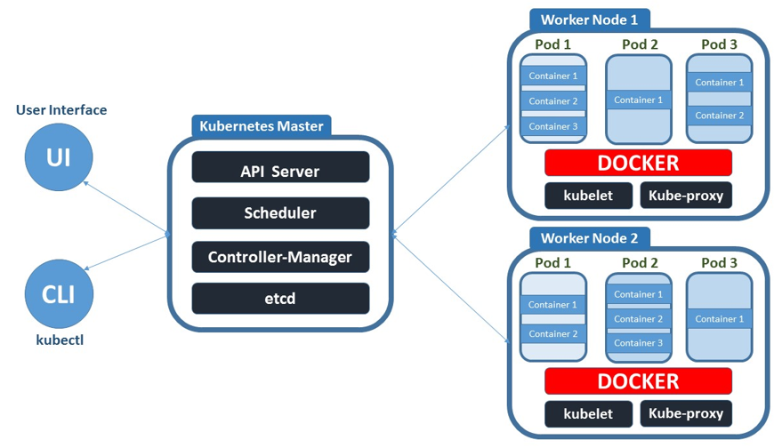
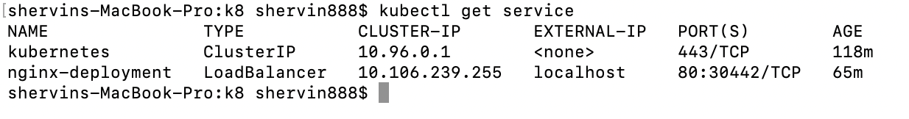

# Kubernetes


##### What is Kubernetes

- Kubernetes, also known as K8s, is an open-source system for automating deployment, scaling, and management of containerized applications.

## Benefits

- <b>Portability and Flexibility:</b> Virtually works with any type of container runtime. It als works with any type of underlying infrastructure whether public, or private cloud.
- <b>Multi-cloud capability: </b>Kubernetes can host workloads running on a single cloud as well as workloads that are spread across multiple clouds. In addition, Kubernetes can easily scale its environment from one cloud to another.
- <b>Stability: </b>allows you to have rolling updates to change your software without downtime. It is further possible to set up Kubernetes in a way that it supports high availability applications and if you are using the public cloud services of major vendors, you can be pretty sure to reach a very high uptime.
- <b>Load Balancing :</b> Can distributing a set of tasks over a set of resources, with the aim of making their overall processing more efficient.
- <b>Self healing:</b> If failures occur k8 will rectify this by spinning up a new resource to replace the broken one.
- <b>Auto Scaling</b>
- <b>Automatic bin Stacking</b>
- <b>Storage Orchestration</b>


## Drawbacks
- <b>Complex: </b>Kubernetes is infamously known for its complexity. Especially for developers not familiar with infrastructure technologies, it can be very hard to get used to the Kubernetes development workflow.


## Competitors
- Mirantis Cloud Native Suite
- Amazon Elastic Container Service
- Red Hat OpenShift
- Azure Container Instances
- IBM Cloud Kubernetes Service

## Why not to use Kubernetes

- In order to take advantage of its features, developers and IT operators must have knowledge of containers, network, security, portability, resiliency, and Kubernetes itself. To make proper use of its workloads, you should understand how each component works. To manage a cluster, you should understand its architecture, storage, API, and administrative system, which is a lot different from traditional virtualized environments.
- Kubernetes is a platform designed to boost performance and reduce the operational effort of distributed systems. It basically makes a complex scenario, like microservices, less operationally complex. It is best not to use it due to it's complexity If you're not dealing with many applications.

## Use Cases



- <b>Microservices architecture:</b> A use case where you want to deploy a more complicated app with many components that will communicate with one another is a classic scenario for Kubernetes.
- <b>Local servers to cloud:</b> frequently today, as software is migrated from on-prem infrastructure to cloud solutions  First, such a big app working outside the cloud is moved to the same big app in Kubernetes.
- <b> Computing power Balance:</b>  Kubernetes cluster is a good solution to manage the distribution of computing power across multiple computers.
- <b> CI/CD :</b> Kubernetes also brings considerable benefits to Continuous Integration/Continuous Deployment or Continuous Delivery methodology.


## Managed Services

Managed Kubernetes is when third-party providers take over responsibility for some or all of the work necessary for the successful set-up and operation of K8s. Some managed platforms include 

- Google Kubernetes Engine (GKE)
- AWS Elastic Container Service for Kubernetes (Amazon EKS)
- OpenShift

In Short if, we are looking for a way to take advantage of the benefits of Kubernetes with a hands-off approach, a fully managed platform solution is ideal.

## K8 Commands

- Some K8 commands can be seen below..

```yml
kubectl get service           =====> Lists all services
kubectl get node              =====> Lists all nodes
kubectl get pods              =====> Lists all pods
kubectl get deploy            =====> Lists all deployments
kubectl create <YML> -f       =====> Creates Service 
kubectl edit deploy <NAME>    =====> Edit file
kubectl edit svc <NAME>       =====> Edit file
kubectl delete deploy <NAME>  =====> Delete pod
```


### Running Nginx Using K8

- Firstly, we need to create a YAML file. The file is used to create the pod. 
- The YAML file in this case is called 'nginx_k8_deploy.yml'.
- The following below is what is contained within the YAML file.

```yml
## nginx_k8_deploy.yml

apiVersion: apps/v1
kind: Deployment

metadata:
  name: nginx-deployment

spec:
  selector:
    matchLabels:
      app: nginx    # looks for label to match k8 services
      
  replicas: 2    #Creates two pods

  template:
    metadata:
      labels:
        app: nginx

    spec:
      containers:
      - name: nginx
        image: nginx
        ports:
        - containerPort: 80
```
- We can now move on to creating.
- We do this via `kubectl create -f nginx_k8_deploy.yml`.
- We can verify that all is well if we see the following when we enter the command `kubectl get service`.



- Next We create a YAML file called 'nginx_service.yml'.
  
- The file will contain the following.
- We then create via `kubectl create -f nginx_service.yml`
```yml
## nginx_service.yml
apiVersion: v1
kind: Service


metadata:
 creationTimestamp: "2021-08-23T11:07:26Z"
 name: nginx-deployment
 namespace: default
 resourceVersion: "40883"
 uid: 9190ab75-d61c-4ff4-a3d1-0d293fa8d72e


spec: 
#  clusterIP: 10.96.0.1
#  clusterIPs:
#  - 10.96.0.1
#  externalTrafficPolicy: Cluster
#  ipFamilies:
#  - IPv4
#  ipFamilyPolicy: SingleStack
 ports:
 - nodePort: 30442
   port: 80
   protocol: TCP
   targetPort: 80
 selector:
   app: nginx
 sessionAffinity: None
 type: LoadBalancer
status:
 loadBalancer:
   ingress:
   - hostname: localhost
```
- We can now successfully see nginx on localhost.


## MongoDb, NodeJS, Docker and Kubernetes 

- In this iteration we will be deploying the node app with mongodb on a docker container using kubernetes.
- We are going to need four files. Two for nginx deployment and service and two for the Mongodb.
- Our first priority, is to create the nginx Server. The following can be seen in the previous iteration.
- Next we create our mongo database via the following.

```yml
## mongo-deployment.yml
apiVersion: apps/v1
kind: Deployment
metadata:
  name: mongo
  
  
spec:
  selector:
    matchLabels:
      app: mongo
  replicas: 1
  template:
    metadata:
      labels:
        app: mongo
    spec:
      containers:
        - name: mongo
          image: mongo
          ports:
            - containerPort: 27017
          volumeMounts:
            - name: storage
              mountPath: /data/db
      volumes:
        - name: storage
          persistentVolumeClaim:
            claimName: mongo-db

```

- Then the mongo-service.yml file.

```yml
# mongo-service.yml

apiVersion: v1
kind: PersistentVolumeClaim
metadata:
  name: mongo-db
spec:
  accessModes:
    - ReadWriteOnce
  resources:
    requests:
      storage: 256Mi
      
      
      
---
apiVersion: v1
kind: Service
metadata:
  name: mongo
spec:
  selector:
    app: mongo
  ports:
    - port: 27017
      targetPort: 27017
```

- We now run the file to create a pod for the node app. 
- The first file to create is called node_deployment and can be seen below.

```yml
# node_deployment.yml

apiVersion: apps/v1
kind: Deployment
metadata:
  name: node
  
  
spec:
  selector:
    matchLabels:
      app: node
      
  replicas: 3
  template: 
    metadata:
      labels:
        app: node
    spec:
      containers:
        - name: node
          image: monotiller/eng89_node_app
          ports:
            - containerPort: 3000
          env:
            - name: DB_HOST
              value: mongodb://mongo:27017/posts
          imagePullPolicy: Always
```

- Now we create node-service.yml.
- We also create node-hpa.yml

```yml
## node-service.yml
apiVersion: v1
kind: Service
metadata:
  name: node
spec:
  selector:
    app: node
  ports:
    - port: 3000
      targetPort: 3000
  type: LoadBalancer    

```

```yml
apiVersion: autoscaling/v1
kind: HorizontalPodAutoscaler

metadata:
  name: node
  namespace: default

spec:
  maxReplicas: 9
  minReplicas: 2
  # target your node-app-deployment so the 
  # hpa knows which deployment to scale up on demand, scale down when no longer
  scaleTargetRef:
    apiVersion: app/v1
    kind: Deployment
    name: node
  targetCPUUtilizationPercentage: 50

```